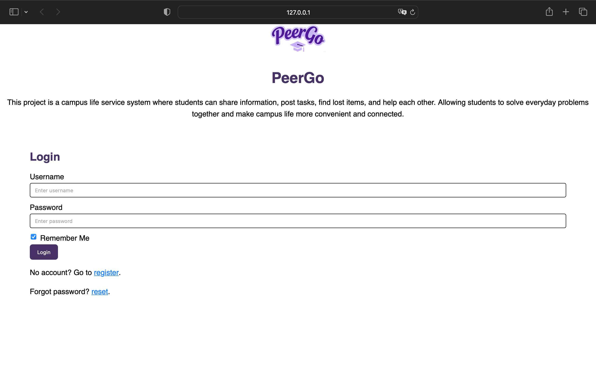
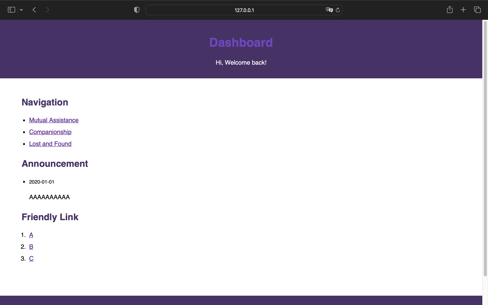
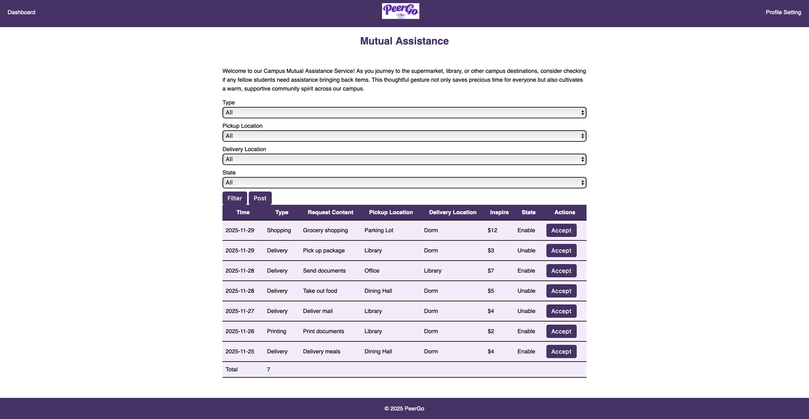
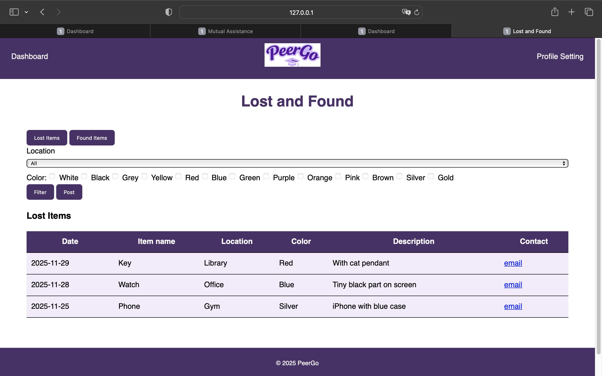
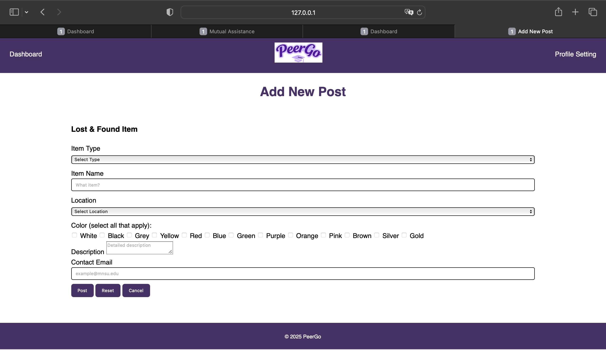

# Campus Mutual Assistance Platform (PeerGo)

This project is a campus life service system where students can share information, post tasks, find lost items, and help each other. Allowing students to solve everyday problems together and make campus life more convenient and connected.

## Features

### User Authentication
- **Login Page**: Secure username and password login verification
- **Registration Page**: New user registration with email verification ending in @mnsu.edu
- **Password Reset**: Forgot password functionality with email reset

### Dashboard
- Central navigation hub to access all services

### Service Pages
- **Mutual Assistance Service**: View and request mutual assistance services
- **Lost & Found**: Browse lost and found items
- **Companionship Service**: Upcoming companionship forum

### Add New Posts
- **Add Mutual Assistance Request**: Submit new mutual assistance requests, including pickup/delivery locations
- **Add Lost/Found Item**: Post lost or found items with detailed descriptions

## Screenshots

1. Login Page
   

2. Dashboard
   

3. Mutual Assistance Service Page
   

4. Lost & Found Page
   

5. Add New Posts
   
